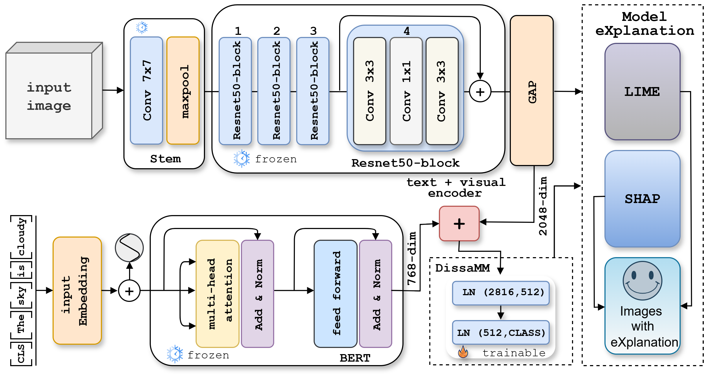

# DissaMM: Explainable Multi-Modal AI for Disaster Response

DissaMM is a lightweight, explainable, multi-modal neural architecture for classifying disaster-related social media posts. It uses a modified ResNet-50 for image feature extraction and BERT for textual encoding, with their outputs fused through a compact MLP head. This design enables real-time, interpretable disaster monitoring to support humanitarian operations, while keeping computational cost low. Figure 1 illustrates the architectural design.

<p align="center">
  
  <br>
  <em>Figure: Architecture of the DissaMM model</em>
</p>

## Features

- ⚡ **Lightweight & real-time inference** – optimized for speed in resource-constrained environments using TL.  
- 🔗 **Multi-modal (text + image)** – processes both visual and textual information for richer context, unlike DisasterNet which relies only on images. Since social media posts are often noisy, we add a textual encoder to provide additional context.  
- 🔍 **Explainability** – integrates LIME and SHAP to generate transparent, human-interpretable decision-making visuals.  
- 🌍 **Low-resource optimization** – tailored for deployment in emerging regions with limited computational resources.  


## Installation

Clone the repository and install dependencies:

```bash
git clone https://github.com/yunusa2k2/DissaMM.git
cd DissaMM
pip install -r requirements.txt
