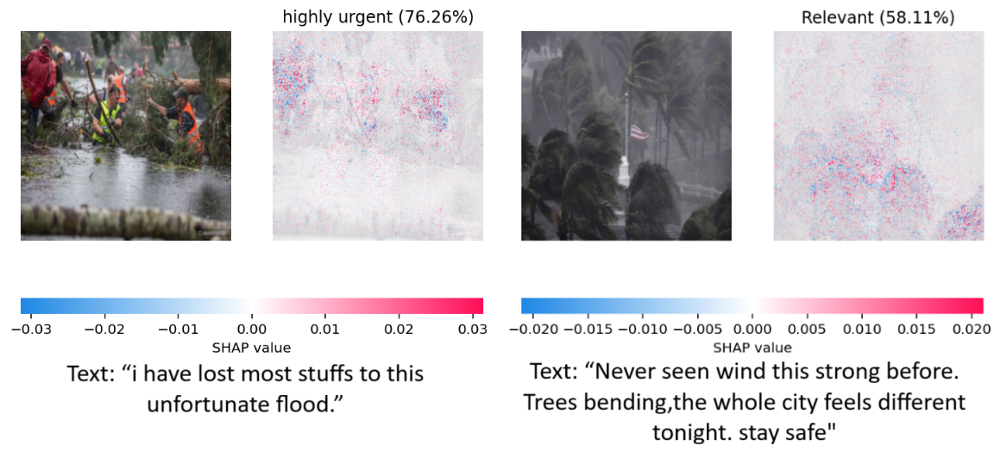

# DissaMM: Explainable Multi-Modal AI for Disaster Response

DissaMM is a lightweight, explainable, multi-modal neural architecture for classifying disaster-related social media posts. It uses a modified ResNet-50 for image feature extraction and BERT for textual encoding, with their outputs fused through a compact MLP head. This design enables real-time, interpretable disaster monitoring to support humanitarian operations, while keeping computational cost low. Figure 1 illustrates the architectural design.

<p align="center">
  
  <br>
  <em>Figure: Architecture of the DissaMM model</em>
</p>

## Features

- ⚡ **Lightweight & real-time inference** – optimized for speed in resource-constrained environments using TL.  
- 🔗 **Multi-modal (text + image)** – processes both visual and textual information for richer context, unlike DisasterNet which relies only on images. Since social media posts are often noisy, we add a textual encoder to provide additional context.  
- 🔍 **Explainability** – integrates LIME and SHAP to generate transparent, human-interpretable decision-making visuals.  
- 🌍 **Low-resource optimization** – tailored for deployment in emerging regions with limited computational resources.  


## Installation

Clone the repository and install dependencies:

```bash
git clone https://github.com/yunusa2k2/DissaMM.git
cd DissaMM
pip install -r requirements.txt
```
### Pre-trained Weights & Inference Results

* The BERT encoder used is [`bert-base-uncased`](https://huggingface.co/bert-base-uncased), whose weights are frozen in DissaMM.
* Complete inference results for **DisasterNet**, **Dissa**, and **DissaMM** across all five classes (**time period, urgency, relevance, damage, relief**) are available for download [here](https://drive.google.com/drive/folders/1FU5E5CWJedsm7FU5wATk3Vh200ARxbb3?usp=sharing).

## Dataset

For training and evaluation, we used the **DisasterNet dataset** introduced by Johnson et al. (2020).  

- **Source**: Collected via Twitter’s *Spritzer* stream (1% random sample of tweets) during **Hurricane Harvey (Aug 17 – Sep 17, 2017)**.  
- **Filtering**: Tweets were retrieved using disaster-related keywords such as  
  `hurricane`, `harvey`, `hurricaneharvey`, `harveyhouston`.  
- **Media**: Linked images were downloaded, deduplicated via MD5 checksums, and cleaned.  
- **Final dataset size**: ~17,483 unique images.  
- **Annotations**: A human-coded subset of 1,128 images was labeled by categories:  
  - **Time period**: pre-storm, landfall, aftermath/cleanup  
  - **Urgency**: 0 (spam/unrelated) → 4 (highly urgent)  
  - **Relevance**: whether the image is relevant to the disaster  
  - **Motifs**: presence of `damage` and `relief` motifs  


> ⚠️ **Note**: This dataset is **not included** in this repository. Please refer to the original publication for details on access:  
> Johnson, M., Murthy, D., Robertson, B., Smith, R., & Stephens, K. (2020).  
> *DisasterNet: Evaluating the performance of transfer learning to classify hurricane-related images posted on Twitter.* Proceedings of the International Conference on Web and Social Media (ICWSM).

## Results

We evaluated **DissaMM** against the **DisasterNet baseline** across five disaster classification tasks: **time period, urgency, relevance, and (damage, and relief) motifs. Performance metrics include training/validation loss, accuracy, and F1 scores (macro and micro).

| Model       | Task        | Train Loss | Train Acc. | Val. Loss | Val. Acc. | F1 Macro | F1 Micro |
| ----------- | ----------- | ---------- | ---------- | --------- | --------- | -------- | -------- |
| DisasterNet | Time Period | 0.6398     | 0.7705     | 0.7515    | 0.6770    | 0.3735   | 0.5012   |
| DisasterNet | Urgency     | 0.9514     | 0.6098     | 1.0841    | 0.6195    | 0.5847   | 0.6157   |
| DisasterNet | Relevance   | 0.3313     | 0.9035     | 0.5222    | 0.8186    | 0.7520   | 0.8110   |
| DisasterNet | Damage      | 0.1441     | 0.9957     | 0.2530    | 0.9023    | 0.6973   | 0.4375   |
| DisasterNet | Relief      | 0.1280     | 0.9484     | 0.2335    | 0.9336    | 0.8240   | 0.7568   |
| **DissaMM** | Time Period | 0.6198     | 0.7905     | 0.7633    | 0.5714    | 0.5902   | 0.5714   |
| **DissaMM** | Urgency     | 0.9314     | 0.6298     | 1.0641    | 0.6395    | 0.6047   | 0.6357   |
| **DissaMM** | Relevance   | 0.3113     | 0.9235     | 0.5022    | 0.8386    | 0.6285   | 0.7086   |
| **DissaMM** | Damage      | 0.1241     | 0.9980     | 0.2330    | 0.9223    | 0.8500   | 0.8914   |
| **DissaMM** | Relief      | 0.1080     | 0.9684     | 0.2166    | 0.9343    | 0.8440   | 0.9343   |

**Analysis**:

* **DissaMM outperforms DisasterNet** in most tasks, particularly for **Damage** (macro F1 ↑ 0.697 → 0.850; micro F1 ↑ 0.438 → 0.891) and **Relief** (macro F1 ↑ 0.824 → 0.844; micro F1 ↑ 0.757 → 0.934).
* Time Period classification improves (macro F1 ↑ 0.374 → 0.590), reflecting better temporal context modeling.
* Gains in Urgency are modest but positive.
* Relevance shows higher accuracy but slightly lower macro F1 (0.752 → 0.629), indicating stronger majority-class performance but weaker balance across all categories.
* Overall, **DissaMM demonstrates robust and balanced generalization**.

## Computational Complexity & Runtime

We compared **DisasterNet (baseline)**, **Dissa (unimodal)**, and **DissaMM (multi-modal)** on efficiency metrics including parameters, FLOPs, latency, throughput, and memory usage (FP32/FP16):

| Model       | Precision | Trainable Params (M) | FLOPs (G) | Latency (ms) | Throughput (img/sec) | Memory (MB) |
| ----------- | --------- | -------------------- | --------- | ------------ | -------------------- | ----------- |
| DisasterNet | FP32      | 39.82                | 15.42     | 40.13        | 199.37               | 1142.75     |
| DisasterNet | FP16      | 39.82                | 15.42     | 18.40        | 434.77               | 990.17      |
| Dissa       | FP32      | 2.07                 | 4.13      | 20.57        | 388.86               | 404.46      |
| Dissa       | FP16      | 2.07                 | 4.13      | 10.14        | 788.99               | 324.93      |
| DissaMM     | FP32      | 1.51                 | 3.02      | 0.56         | 14,208.95            | 680.51      |
| DissaMM     | FP16      | 1.51                 | 3.02      | 0.22         | 35,797.50            | 656.94      |

**Analysis**:

* Transfer learning with frozen backbones (ResNet50 + BERT), training **only the final MLP layer**, drastically reduces trainable parameters and FLOPs.
* **Dissa** cuts trainable parameters to 2.07M, halves latency, and doubles throughput under FP16.
* **DissaMM** achieves high efficiency: 1.51M trainable parameters, 3.02 GFLOPs, sub-millisecond latency, and >35k images/sec throughput (FP16) with moderate memory (~680 MB).
* This demonstrates that frozen multi-modal embeddings with a lightweight trainable head enable fast, low-memory inference suitable for edge deployment.

## Explainability with LIME

We use LIME (Local Interpretable Model-agnostic Explanations) to interpret DissaMM’s predictions by first segmenting an input image into superpixels and creating perturbed versions by masking these regions. The model’s predictions on the perturbed samples are then used to fit a simple local surrogate model that approximates the behavior of the complex network. From this, the top five most influential superpixels and textual tokens contributing to the prediction are identified. Results show that DisasterNet highlights scattered, often irrelevant regions and missed classification, while DissaMM (multi-modal) effectively emphasizes disaster-relevant image areas and textual tokens, improving both confidence and alignment with human judgment. Figures 2a and 2b show DisasterNet and DissaMM.

* **DisasterNet (image-only)** – Figure 2a shows large, scattered superpixels, many unrelated to disaster cues, indicating sensitivity to background noise.
* **DissaMM (multi-modal)** – Figure 2b produces focused explanations, highlighting disaster-relevant image regions (e.g., flooded areas, damaged structures) and textual tokens, improving confidence and aligning model reasoning with human judgment.

These analyses demonstrate that **multimodal fusion enhances interpretability**, reduces reliance on noisy inputs, and provides more robust, human-aligned decision support.

<p align="center">
  
  <br>
  <em>Figure 2a: LIME explanations for DisasterNet</em>
  <br><br>
  
  
  <br>
  <em>Figure 2b: LIME explanations for DissaMM</em>
</p>

## 4.2.1. SHAP-Generated Explanations

We applied SHAP to interpret **DisasterNet**, and **DissaMM** on **urgency** and **relevance** tasks. SHAP highlights which image regions or text tokens drive predictions.

* **DisasterNet**: Weak or misplaced attributions, often dominated by noise (Figure 3a).
* **DissaMM**: Produces coherent, disaster-relevant attributions across image and text, yielding confident and human-aligned decisions (Figure 3b).
**Conclusion**: SHAP confirms that multimodal fusion improves interpretability, robustness, and alignment with human reasoning compared to unimodal models.
  
<p align="center">
  
  <br>
  <em>Figure 3a: SHAP explanations for DisasterNet</em>
  <br><br>
  
  
  <br>
  <em>Figure 3b: SHAP explanations for DissaMM</em>
</p>
